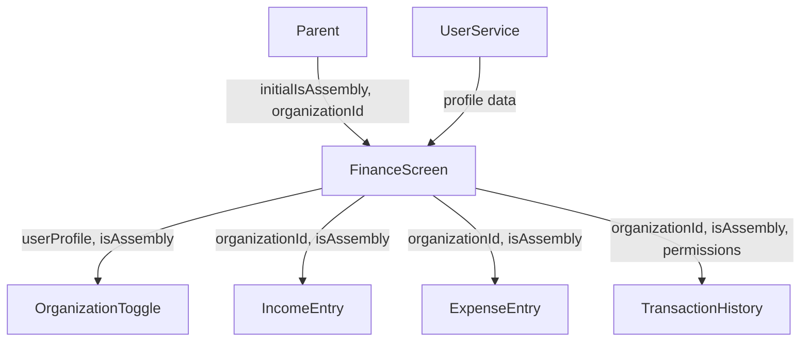

# FinanceScreen Component Documentation

## Overview
The FinanceScreen is a comprehensive financial management interface that handles both Assembly and Council finances. It provides income entry, expense entry, and transaction history viewing capabilities.

## Component Structure

### Parent Components
- Receives data from parent through constructor:
  - `initialIsAssembly`: boolean - determines initial view (Assembly/Council)
  - `organizationId`: string - the organization's identifier

### Child Components
1. **OrganizationToggle**
   - Allows switching between Assembly/Council views
   - Receives:
     - `userProfile`: UserProfile - for assembly/council numbers
     - `isAssembly`: boolean - current view state
     - `onChanged`: callback for view switching

2. **IncomeEntry**
   - Collapsible form for income entries
   - Receives:
     - `organizationId`: string
     - `isAssembly`: boolean

3. **ExpenseEntry**
   - Collapsible form for expense entries
   - Receives:
     - `organizationId`: string
     - `isAssembly`: boolean

4. **TransactionHistory**
   - Displays all financial transactions
   - Receives:
     - `organizationId`: string
     - `isAssembly`: boolean
     - `hasEditPermission`: boolean
     - `hasDeletePermission`: boolean

## Services Used
- **UserService**
  - `getUserProfile()`: Fetches user profile for permissions and organization details

## State Management
- `_isLoading`: Loading state indicator
- `_isAssembly`: Current view type (Assembly/Council)
- `_organizationId`: Current organization identifier
- `_userProfile`: Cached user profile data
- `_showIncomeEntry`: Income form visibility toggle
- `_showExpenseEntry`: Expense form visibility toggle
- `_hasFullAccess`: User permissions flag

## Flow
1. Component initializes with assembly/council selection and organization ID
2. Loads user profile to determine permissions
3. Allows toggling between Assembly/Council views
4. Displays collapsible income and expense entry forms
5. Shows transaction history below entry forms
6. Updates all child components when organization changes

## Permissions
- Full access users can:
  - View all transactions
  - Edit transactions
  - Delete transactions
- Regular users can:
  - View transactions
  - Add new entries

## Styling
- Uses `AppTheme` for consistent styling
- Card-based layout with proper spacing
- Collapsible sections for better space management

## Error Handling
- Shows loading indicator during profile fetch
- Displays error message if organization unavailable
- Uses SnackBar for error notifications

## Data Flow

## Future Considerations
1. Keep the current structure which works well
2. Maintain the simple toggle between Assembly/Council
3. Preserve the collapsible forms for space efficiency
4. Keep the transaction history as a separate component
5. Continue using the global AppTheme for styling